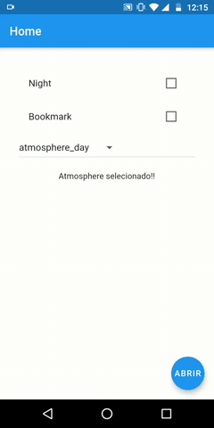
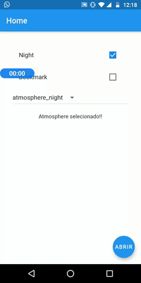
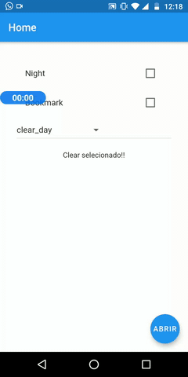
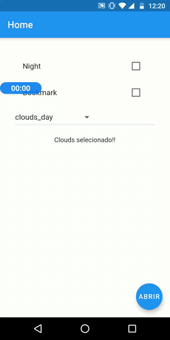
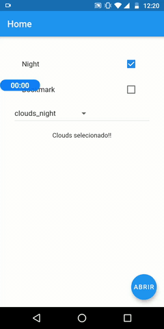
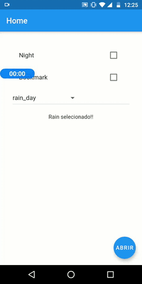
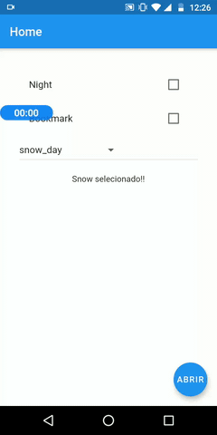
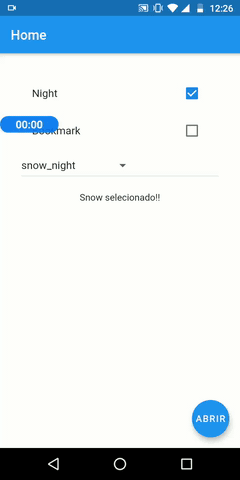
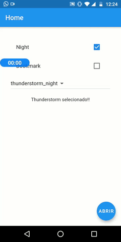

# Bottom sheet weather - FLUTTER

Desgin de uma bottom sheet utilizando lottie para animações a cada mudançã de clima.

Core Dependencies: 

* Lottie: https://pub.dev/packages/lottie (animações)
* Get: https://pub.dev/packages/get (injetar widgets sem dependência de context específico)
* Google Fonts: https://pub.dev/packages/google_fonts 

## Interfaces
- **Atmosphere** (day and night)
- **Clear** (day and night)
- **Clounds** (day and night)
- **Drizzle** (day and night)
- **Rain** (day and night)
- **Snow** (day and night)
- **Thunderstorm** (day and night)

## Demonstração de funcionamento

                    

